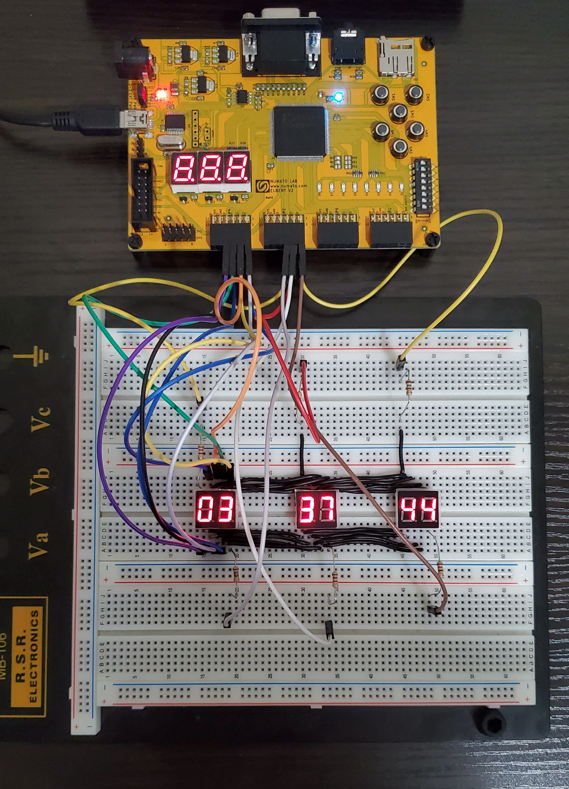

# FPGA Clock
A digital clock built using an FPGA development board and multiplexed seven segment displays.  
Increment and decrement hours with SW1 (Switch 1) and SW2.  
Increment and decrement minutes with SW6 and SW4.

Excuse the spaghetti wires :)
